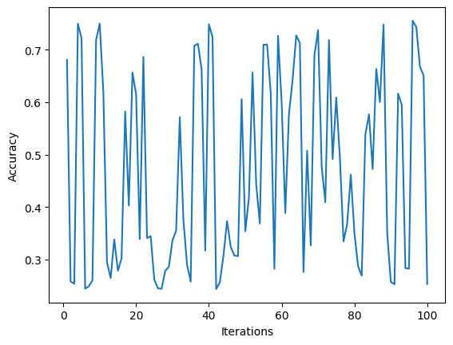

## Submitted by:

**Name:** Aryan Dogra  
**Roll no:** 102103235
**Batch:** 3CO9  

# Multi-Class Support Vector Machine (SVM) for Income Prediction

## Introduction

This project focuses on implementing a multi-class Support Vector Machine (SVM) algorithm for predicting income levels using the `Adult Census Income` dataset sourced from the UCI Machine Learning Repository. The dataset comprises `15 columns` and `32561 rows`.

The `Adult Census Income` dataset provides information about individuals, including their age, education level, marital status, occupation, and whether they earn more than $50K per year.

## Data Preprocessing

To prepare the dataset for classification, several preprocessing steps were applied:

1. Handling Missing Values: Replaced "?" values with the mode of the respective column.
2. Encoding Categorical Features: Utilized one-hot encoding for categorical features.
3. Standardizing Numerical Features: Standardized numerical features using the StandardScaler from scikit-learn.

## Model Training and Testing

The dataset was split into training (70%) and testing (30%) sets. The SVM model underwent parameter optimization, including:

- Iterating over 1000 iterations.
- Exploring random values of C and gamma ranging between 0 and 1.
- Trying different kernels.

Optimization was conducted on 10 distinct samples of the dataset. The best accuracy and SVM parameters were recorded for each sample.

## Results Summary

Here are the summarized optimization results for each sample:

| Sample | Best Accuracy | Best C | Best Gamma | Best Kernel |
|--------|---------------|--------|------------|-------------|
| 1      | 0.779814      | 0.6215 | 0.1837     | RBF         |
| 2      | 0.800287      | 0.7293 | 0.6811     | Poly        |
| 3      | 0.797728      | 0.7289 | 0.4610     | Poly        |
| 4      | 0.782168      | 0.0531 | 0.1680     | RBF         |
| 5      | 0.802743      | 0.2599 | 0.2012     | Poly        |
| 6      | 0.798649      | 0.4441 | 0.5681     | Poly        |
| 7      | 0.793428      | 0.3606 | 0.1258     | Poly        |
| 8      | 0.794964      | 0.8704 | 0.9407     | Poly        |
| 9      | 0.790562      | 0.6741 | 0.0391     | RBF         |
| 10     | 0.794145      | 0.0856 | 0.1095     | RBF         |

The highest accuracy was achieved in `sample 5`, with an accuracy of `0.802743`.

## Conclusion

